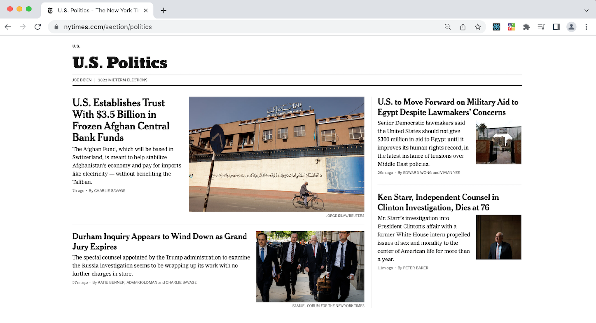

<!-- PROJECT TITLE PAGE -->
<br />
<div align="center">
  
  <h1 align="center">Brighter Days Chrome Extension</h1>
</div>


<!-- ABOUT THE PROJECT -->
## About The Project

**Why?** I wanted to sharpen my DOM understanding and manipulation skills with vanilla javascript. I've also always wanted to learn what goes into making a chrome extension so I made this one that replaces every image with a puppy and every header with a motivational quote.

**TL;DR** In a world where we are constantly solicited by angering or saddening news, we could all use a little more serotonin. 

#### See the same New York Times page at "nytimes.com/section/politics" with and without the extension:



<p align="right">(<a href="#top">back to top</a>)</p>


<!-- GETTING STARTED -->
## Getting Started

To get a local copy up and running follow these steps.

### Prerequisites

You will need to have Node.js and npm package manager installed. If you do not, visit [Node.js](https://nodejs.org/en/) and download the version labeled LTS. To install the latest version of npm run `npm install npm@latest -g`. Ensure that both are correctly installed using `node -v` and `npm -v`.

### Installation

1. Clone the repo into your desired folder with
   ```sh
   git clone https://github.com/JuliaGrandury/brighterdays-extension.git
   ```
2. Go to Google Chrome > Window > Extensions > Load Unpacked > Select the location of the cloned repository or Google Chrome Extensions (by your address bar) > Manage Extensions > Load Unpacked > Select the location of the cloned repository. There you can toggle it on or off as you'd like.

<p align="right">(<a href="#top">back to top</a>)</p>


<!-- ROADMAP -->
## Roadmap

- [ ] Only change sensitive or triggering content
- [ ] Improve loading time

<p align="right">(<a href="#top">back to top</a>)</p>


<!-- LICENSE -->
## License

Distributed under the MIT License. See `LICENSE.txt` for more information.

<p align="right">(<a href="#top">back to top</a>)</p>


<!-- CONTACT -->
## Contact

Julia Grandury - booleanjules@gmail.com

Project Link: [https://github.com/JuliaGrandury/brighterdays-extension](https://github.com/JuliaGrandury/brighterdays-extension)

<p align="right">(<a href="#top">back to top</a>)</p>
